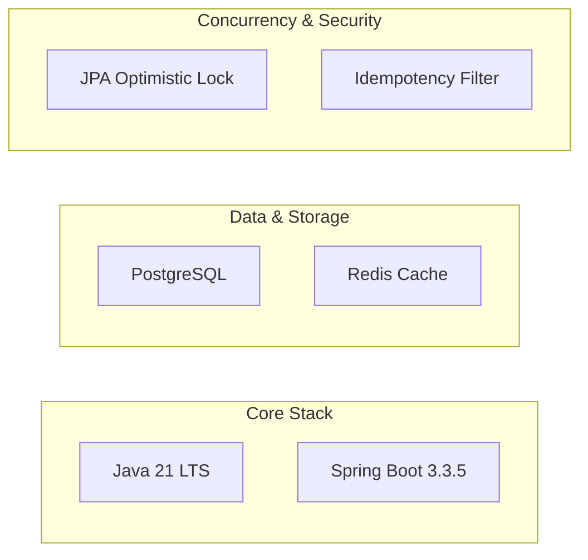

# Architecture Decision Record: Stripe-Lite Ledger Engine

This document provides a comprehensive explanation of the architectural decisions, tech stack selections, and structural design choices governing the **Stripe-Lite Ledger Engine**. 

It details **what** technologies are utilized, **why** they were selected, and **why alternative choices were rejected** to ensure an industry-standard, production-grade system.

---

## 🛠️ Technology Stack & Rationale

---

## 1. Core Framework: Java 21 LTS & Spring Boot 3.3.5

### Why Java 21?
* **Modern Language Primitives:** Java 21 offers `record` classes (perfect for immutable API DTOs), pattern matching, and enhanced switch expressions, resulting in cleaner and more concise code.
* **Virtual Threads (Project Loom):** Standard Java applications historically mapped one thread to one operating system thread, making high-concurrency architectures memory-heavy. Java 21 introduces Virtual Threads, allowing the engine to handle millions of concurrent payment requests with minimal resource usage.

### Why Spring Boot 3?
* **Mature Enterprise Ecosystem:** Out-of-the-box transaction management (`@Transactional`), robust connection pooling (HikariCP), JPA/Hibernate abstractions, and structured configuration.
* **Why not Go or Node.js?** While Go is fast and Node.js is lightweight, Spring Boot provides strict, compile-time transactional safety, excellent database migration support, and a highly structured modular design pattern that enterprise companies (especially FinTechs like Stripe) rely upon for core transaction ledgers.

---

## 2. Core Bookkeeping: Double-Entry Ledger vs. Simple Balance Column

### What is Double-Entry Bookkeeping?
In simple apps, a balance transfer is:
`UserA.balance = UserA.balance - 100` and `UserB.balance = UserB.balance + 100`.
In our ledger engine, a transfer is recorded as a parent **Transaction** with two associated **Ledger Entries**:
1. A **DEBIT** entry of 100 for Account A.
2. A **CREDIT** entry of 100 for Account B.

### Why Double-Entry?
* **Absolute Audit Trail:** Money cannot be modified without creating a permanent record. Every credit has an equal and opposite debit. If balances are corrupted or queried, we can recalculate account balances from the raw journal ledger.
* **Mathematical Invariant:** The sum of all credits and debits in the system must always equal exactly **zero**. This makes fraud or system arithmetic bugs mathematically impossible to hide.
* **Why not a simple balance column?** Changing a balance column without a double-entry log is a fatal flaw in banking. If an update fails midway, money is permanently destroyed or created out of thin air, and there is no trace of where the funds went.

---

## 3. Concurrency Protection: JPA Optimistic Locking vs. Pessimistic DB Locking

### Why Optimistic Locking (`@Version`)?
Optimistic locking assumes that multiple transactions can complete without affecting each other. We use an `@Version` column on the `Account` entity. When updating an account's balance, Hibernate verifies that the version in the database matches the version loaded in memory. If another transaction changed the account in the meantime, it throws an `OptimisticLockException`, which we catch and automatically retry.

* **High Scalability:** Optimistic locking does not hold open exclusive database locks, allowing other threads to perform read operations concurrently. It handles high-frequency, scattered transactions with maximum throughput.
* **Why not Pessimistic Locking (`SELECT ... FOR UPDATE`)?** Pessimistic locking locks the database row exclusively. If multiple concurrent threads try to update the same row, they get queued. Under heavy load, this consumes all database connections in the Hikari pool, leading to **deadlocks** and a complete system standstill.

---

## 4. Duplicate Charge Prevention: Redis Idempotency vs. Database Key Table

### Why Redis?
We use Redis (a fast, in-memory key-value store) to capture and manage `Idempotency-Key` headers.
* **Sub-Millisecond Lookup:** Since payment clients frequently retry requests due to network timeouts, checking if a transaction is already processing must be extremely fast. Redis processes requests at memory speed.
* **Automated Expiry (TTL):** Idempotency keys only need to be cached for a set period (e.g., 24 hours). Redis natively supports Time-To-Live (TTL) expiration, making cleanup automatic and zero-overhead.
* **Concurrency Protection (Atomic Operations):** Redis's single-threaded nature combined with Spring Data's atomic operations ensures that two identical payment requests hitting the system at the exact same millisecond will evaluate safely, allowing exactly one to run while the other is rejected as `IN_PROGRESS`.
* **Why not a database table?** Storing idempotency keys in PostgreSQL would trigger additional read and write queries on every single API call, bloating transactional storage and slowing down database throughput.

---

## 5. Development & Testing: H2 Database vs. Live PostgreSQL

### Why H2 Database for Testing?
* **Portability:** H2 is an in-memory SQL database. It runs within JVM memory, meaning our integration tests execute successfully on *any* developer's machine or CI/CD runner without requiring a running PostgreSQL server.
* **PostgreSQL Mode:** H2 is configured to run in PostgreSQL compatibility mode, meaning it accurately parses Postgres schema structures, indexes, and queries.
* **Why not standard PostgreSQL for testing?** Requiring a live local PostgreSQL instance to run tests forces manual setups (creating tables, adjusting passwords) which slows down development velocity. Using H2 ensures our `./mvnw clean test` suite is fully portable and runs instantly out of the box.
