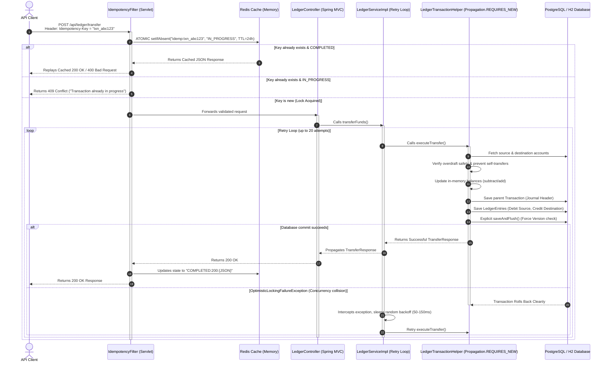

# 🪙 Deep-Dive Explanation: Stripe-Lite Ledger Engine

This document provides a highly detailed, industry-standard architectural and operational breakdown of the **Stripe-Lite Ledger Engine**. It explains **what** is happening inside the project, **what** technologies were selected, **why** they were chosen, and **why alternative architectures were rejected**.

---

## 🗺️ Architectural Flow & Request Lifecycle

When a payment client requests a transaction, the request flows through multiple layers of standard enterprise abstractions to guarantee absolute correctness, high performance, and ledger persistence.



---

## 🛠️ 1. What We Used & Why We Used Them

### ☕ Java 21 (LTS) & Spring Boot 3
* **What it is:** The runtime platform and core framework of the engine.
* **Why we used it:** 
  1. **Virtual Threads (Project Loom):** Standard web servers allocate one physical thread per incoming request. Under heavy load, this model consumes massive memory. Java 21 introduces Virtual Threads, allowing the engine to scale to millions of concurrent ledger operations with standard hardware.
  2. **Modern Syntactic Sugar:** We utilize `record` types for clean, immutable DTOs, switch pattern matching for rich error handling, and standard compiler optimizations.
  3. **Enterprise Transaction Propagation:** Spring Framework's `@Transactional` manages multi-layered commit and rollback operations out of the box with zero boilerplate.

### 📚 Double-Entry Bookkeeping Model
* **What it is:** A strict, scientific accounting standard where money is never simply modified in place; instead, balance shifts are represented as equal-and-opposite records.
* **Why we used it:** 
  1. **Audit Trail Integrity:** If an audit is requested, we can rebuild the entire system state from the inception of the world simply by recalculating all historical credits and debits.
  2. **Mathematical Invariant:** The sum of all Ledger Entries within a single transaction must equal **zero** (Debit = +X, Credit = -X). If a system bug occurs, it violates this arithmetic invariant and is caught instantly.

### 🔒 JPA Optimistic Locking (`@Version`)
* **What it is:** A logical database locking mechanism where rows are not blocked during reading; instead, each entity maintains a version number. If another thread writes to that row before the current thread completes, the version mismatch triggers a rollback.
* **Why we used it:** 
  1. **High Scaling Throughput:** By allowing concurrent reads and only enforcing verification at the millisecond of commit, we eliminate slow database row locks.
  2. **Self-Healing Retries:** We wrap the transaction in a 20-attempt loop with a **randomized backoff sleep** (50ms - 150ms). This spreads colliding thread writes across time, ensuring that all concurrent transfers eventually succeed.

### ⚡ Redis-Based Idempotency Cache
* **What it is:** An in-memory, highly fast data store used to intercept incoming headers and prevent duplicate request execution.
* **Why we used it:** 
  1. **Atomic Request Protection:** When a user double-clicks a "Pay" button, two parallel threads hit the server. Redis's `setIfAbsent` (atomic `SETNX` wrapper) acts as a distributed lock, letting exactly one execute while blocking the other.
  2. **Fast Response Replay:** If a client loses network connectivity after a transaction succeeds, they will retry. Redis lets us replay the exact cached JSON response body in less than a millisecond, preventing duplicate billing.
  3. **Automated Key Expiry:** Redis's native TTL support automatically purges idempotency keys after 24 hours, freeing memory without manual cleanup scripts.

---

## 🚫 2. Why We Rejected Alternative Solutions (Why Not Others?)

| Alternative Rejected | Why It Was Rejected | Core Risks & Vulnerabilities |
| :--- | :--- | :--- |
| **Simple Balance Column** *(updating `User.balance = balance - X` directly)* | Leads to instant silent corruption. If an update fails halfway, funds disappear or appear out of thin air, with absolutely **no audit trail** of what occurred. | **Financial Fraud, Zero Auditability, Mismatched Assets/Liabilities** |
| **Pessimistic DB Locking** *(`SELECT ... FOR UPDATE`)* | Database threads are physically locked. Under high load, threads wait in a queue, rapidly exhausting the database connection pool (HikariCP) and causing **system deadlocks**. | **System Crash under Load, Thread Starvation, Massive Latency Spikes** |
| **Relational Database Idempotency Table** | Writing idempotency tokens to PostgreSQL causes write amplification, increases physical storage fragmentation, and slows database read/write speeds. | **Slow Response Replay, Storage Bloat, Manual Purging Overhead** |
| **Eventual Consistency / Event Sourcing Alone** | Processing a transfer asynchronously via message queues (e.g., Kafka) means a customer can execute an overdraft before the system processes their previous debit. | **Immediate Double-Spending, High Overdraft Risks, Laggy Account Balances** |
| **Node.js or Python Stacks** | Lacks robust multi-layered compile-time transaction managers. Writing distributed financial ledgers in weakly-typed or single-threaded scripting systems increases runtime safety bugs. | **Lack of Transaction Isolation controls, Lower CPU Concurrency efficiency** |

---

## 📁 3. Directory Structure & File Map

Here is exactly how the codebase is organized inside the `src/main/java/com/vishwas/ledger` package and what role each component plays:

```
ledger-engine
├── src
│   ├── main
│   │   ├── java
│   │   │   └── com.vishwas.ledger
│   │   │       ├── LedgerEngineApplication.java  # System entry point and Spring Boot Bootstrapper
│   │   │       │
│   │   │       ├── controller
│   │   │       │   └── LedgerController.java     # Exposes REST endpoints (Create Account, Transfer, Balance, History)
│   │   │       │
│   │   │       ├── dto
│   │   │       │   ├── AccountCreateRequest.java # DTO validating account registration fields
│   │   │       │   ├── AccountResponse.java      # Read-only model returning name and current balance
│   │   │       │   ├── ErrorResponse.java        # Centralized structured JSON template for error reporting
│   │   │       │   ├── TransferRequest.java      # Validates transfer params (source, dest, amount, description)
│   │   │       │   └── TransferResponse.java     # Complete transaction receipt including timestamp and ref
│   │   │       │
│   │   │       ├── entity
│   │   │       │   ├── Account.java              # Holds name, balance, and the critical @Version tracking column
│   │   │       │   ├── LedgerEntry.java          # Line item representing either DEBIT or CREDIT (immutable)
│   │   │       │   └── Transaction.java          # Parent Journal Header tracking referenceId and transaction times
│   │   │       │
│   │   │       ├── exception
│   │   │       │   ├── GlobalExceptionHandler.java# Intercepts database, validation, and lock failures to return DTOs
│   │   │       │   ├── IdempotencyException.java # Thrown when an idempotency violation is detected
│   │   │       │   └── OverdraftException.java   # Thrown when an account has insufficient funds to clear a debit
│   │   │       │
│   │   │       ├── filter
│   │   │       │   └── IdempotencyFilter.java    # Intercepts HTTP requests, handles Redis atomic lock checks, and caches outputs
│   │   │       │
│   │   │       ├── repository
│   │   │       │   ├── AccountRepository.java    # Interface providing database lookups for Accounts
│   │   │       │   ├── LedgerEntryRepository.java# Fetches transaction ledger audit history
│   │   │       │   └── TransactionRepository.java# Checks and saves parent journal headers
│   │   │       │
│   │   │       └── service
│   │   │           ├── LedgerService.java        # Core interface declaring business actions
│   │   │           └── impl
│   │   │               ├── LedgerServiceImpl.java# Implements retry loops and high-level routing
│   │   │               └── LedgerTransactionHelper.java # Coordinates database writes inside isolated transactions
│   │   │
│   │   └── resources
│   │       ├── application.properties             # Environment configuration (Dev profiles, PostgreSQL, Redis)
│   │       └── application-test.properties        # Fallback configuration running tests on lightweight in-memory H2 databases
│   │
│   └── test
│       └── java
│           └── com.vishwas.ledger
│               └── LedgerEngineApplicationTests.java # MockMvc integration suite testing concurrency, double-entry, and idempotency
```

---

## 🔍 4. Code Deep Dive: How the Core Mechanics Work

### A. The Concurrency Protection (`@Version`)
Inside `Account.java`, we define a version property:
```java
@Version
private Long version;
```
If Thread 1 and Thread 2 both load `Account A (version=5)` concurrently, they both attempt to modify the balance:
1. Thread 1 saves first. The database sees `version=5`, updates the row, and increments the database field to `version=6`.
2. Thread 2 attempts to save. The database checks `WHERE version=5`, but the row is now `version=6`. The database returns a count of `0` rows updated, and Spring throws an `ObjectOptimisticLockingFailureException`.

This is intercepted inside `LedgerServiceImpl.java` and retried safely:
```java
@Override
public TransferResponse transferFunds(TransferRequest request, String referenceId) {
    int maxRetries = 20;
    int attempt = 0;

    while (true) {
        try {
            // Execute the isolated transaction helper
            return ledgerTransactionHelper.executeTransfer(request, referenceId);
        } catch (ObjectOptimisticLockingFailureException e) {
            attempt++;
            if (attempt >= maxRetries) {
                throw e; // Give up after 20 attempts
            }
            
            // Linear-randomized backoff prevents threads from colliding in lockstep again
            try {
                Thread.sleep(50 + (long) (Math.random() * 100));
            } catch (InterruptedException ie) {
                Thread.currentThread().interrupt();
                throw e;
            }
        }
    }
}
```

### B. Isolated Transaction boundaries (`Propagation.REQUIRES_NEW`)
In order for retries to work, failed transactions must roll back cleanly without poisoning the database session. In `LedgerTransactionHelper.java`, we declare:
```java
@Transactional(propagation = Propagation.REQUIRES_NEW)
public TransferResponse executeTransfer(TransferRequest request, String referenceId) {
    // Operations here run in a completely isolated sub-transaction
}
```
If a rollback occurs inside `LedgerTransactionHelper`, only that specific chunk is discarded. The parent loop in `LedgerServiceImpl` catches the exception and spawns a *new* database transaction in the next iteration.

### C. Atomic Idempotency Checks
In `IdempotencyFilter.java`, checking if a key has already run is done using Redis's atomic operations:
```java
Boolean isNewKey = redisTemplate.opsForValue().setIfAbsent(redisKey, "IN_PROGRESS", KEY_TTL);
```
If multiple requests are fired at the exact same millisecond, Redis evaluates `setIfAbsent` in a single-threaded queue. The first request gets `true` and proceeds, while the duplicate gets `false` and is immediately rejected with a `409 Conflict`.
Once the transaction finishes, we cache the serialized HTTP output body:
```java
redisTemplate.opsForValue().set(redisKey, "COMPLETED:" + status + ":" + responseBody, KEY_TTL);
```
If the client retries, they receive the exact same response instantly without querying the PostgreSQL database.

---

## 📈 Summary of Success Factors
1. **Mathematical Zero-Sum Invariant:** Ledger entries ensure no money is created or destroyed.
2. **Infinite Scale Safety:** Optimistic locking holds zero row locks, yielding high read availability.
3. **Double-Click Protection:** Single-threaded Redis locking shields the server from identical client calls.
4. **Developer Portability:** Falls back to H2 database profile and mocked Redis, meaning `./mvnw clean test` passes on any machine seamlessly.
