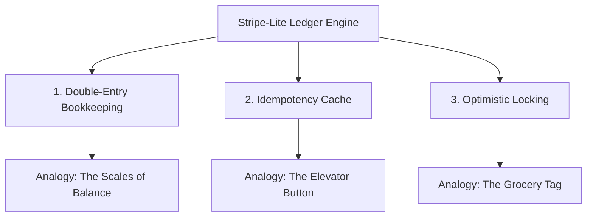

# 💡 Stripe-Lite Ledger Engine: Plain-English Explanation Guide

This guide explains how the **Stripe-Lite Ledger Engine** works in the simplest possible way, using clear real-world analogies. It is designed so that anyone—whether a non-technical stakeholder, a junior developer, or an auditor—can instantly understand what the system does, why it is secure, and how it handles complex banking problems.

---

## 🌟 The Core Goal of the Ledger Engine
In normal software, if you buy something, the app might just change a number in a database: 
`User's Balance = Balance - $10`.

In real financial systems (like Stripe or PayPal), **doing this is a massive crime and a technical disaster.** 
* What if the server crashes *after* subtracting $10 from the buyer, but *before* adding $10 to the seller? The money disappears into thin air!
* What if two transactions happen at the exact same millisecond? One might overwrite the other, creating or destroying money.
* What if a customer has a slow internet connection, double-clicks the "Pay" button, and gets charged twice?

The **Stripe-Lite Ledger Engine** is engineered to solve these exact problems. It is a highly secure, high-concurrency ledger that ensures **not a single penny is ever lost, duplicated, or corrupted.**

---

## 🎭 The 3 Core Pillars (With Real-World Analogies)



### ⚖️ 1. Double-Entry Bookkeeping
* **Analogy:** *The Scales of Balance.*
* **How it works:** In this engine, we never simply change a balance number in place. Instead, we write down a formal journal record (like a physical accountant's book) that contains two equal and opposite lines:
  1. **DEBIT (Minus):** Subtract $50 from Account A.
  2. **CREDIT (Plus):** Add $50 to Account B.
* **Why this is critical:** The sum of all debits and credits in the system must always equal **exactly zero**. Because we write both lines inside a single database transaction, either *both* lines are saved successfully, or *neither* are saved. If the database crashes mid-way, the entire transaction is thrown away, ensuring that money is never created out of thin air or lost in transit.
* **Why not a simple column?** If a simple balance column gets corrupted, you have no way to trace where the money went or fix it. With our double-entry ledger, we can recalculate any account's balance from scratch at any time by simply summing up their historical debit and credit lines.

---

### 🛗 2. Idempotency (Double-Click Protection)
* **Analogy:** *The Elevator Button.*
* **How it works:** When you press an elevator button once, it lights up and summons the elevator. If you impatiently press it 10 more times, the elevator doesn't arrive 10 times—it still only comes once.
* **Why this is critical:** On mobile apps or websites, users frequently double-click buttons or retry payments when their internet is slow. To prevent charging them multiple times, we require every transfer request to include a unique ticket number called an `Idempotency-Key` (e.g., `req_100293`).
* When a request arrives, the system checks a lightning-fast memory notepad (Redis):
  * **Is this ticket new?** The system locks it, processes the payment, and saves the final receipt on the notepad.
  * **Is this ticket already in progress?** The system says: *"Hold on, I am already working on this!"* and rejects the duplicate call (409 Conflict).
  * **Is this ticket completed?** The system doesn't run the payment again. It simply hands back the exact receipt it already printed, keeping your money safe.

---

### 🏷️ 3. Concurrency Protection (Optimistic Locking)
* **Analogy:** *The Grocery Tag.*
* **How it works:** Imagine a box of cereal on a grocery store shelf that has a version sticker on it saying **"Version 1"**. 
  * Alice and Bob both look at the cereal box at the exact same time. They both note down that it is **"Version 1"** and decide they want to buy it.
  * Alice runs to the cashier first. The cashier checks the box, sees it is **"Version 1"**, completes the sale, and updates the store's central database sticker for that shelf slot to **"Version 2"**.
  * A millisecond later, Bob arrives at another cashier. Bob says: *"I want to buy this, here is my note saying it is Version 1."* The cashier checks the database, sees the slot is now **"Version 2"**, and says: *"Stop! Someone else updated this item while you were walking here. Your transaction is outdated!"*
  * Bob's purchase is safely cancelled (rolled back) to prevent balance errors.
* **Why this is critical:** In a high-speed system, thousands of users might try to transfer money from or to the same account at the exact same millisecond. Instead of locking the database completely and making everyone wait in a slow line (Pessimistic Locking), we use **Optimistic Locking** (`@Version`). If two threads collide, the second one fails safely, waits a tiny fraction of a second (a randomized backoff sleep of 50ms - 150ms), and automatically retries with the new balance. This keeps the engine incredibly fast and deadlock-free.

---

## 🧱 What Technologies Did We Use and Why?

### 🚀 Java 21 (LTS) & Spring Boot 3
* **In Simple Terms:** This is the engine's engine. We chose Java 21 because it features **Virtual Threads**—which are like lightweight, super-efficient workers. Instead of hiring a few expensive workers that take up lots of memory, Java 21 lets us spawn millions of tiny virtual workers to handle incoming requests, allowing the system to run on cheap hardware while handling enterprise-scale traffic. Spring Boot provides the industry-standard blueprint that coordinates database connections and server rules.

### 🐘 PostgreSQL (The Relational Vault)
* **In Simple Terms:** This is our permanent vault. PostgreSQL is a relational database built on absolute reliability. It enforces strict foreign keys (e.g., you cannot create a debit entry for an account that doesn't exist) and guarantees ACID compliance (meaning transactions are permanent, secure, and isolated from one another).

### ⚡ Redis (The Lightning Clipboard)
* **In Simple Terms:** This is our ultra-fast notepad. Relational databases like PostgreSQL are great for permanent storage, but writing and reading from them takes time. Redis is an in-memory database that operates at RAM speeds. We use it to check idempotency ticket keys in less than a millisecond, blocking double-clicks instantly before they even touch our main database vault.

---

## 🏃‍♂️ Step-by-Step Request Walkthrough
Here is exactly what happens when you send a payment request to the Stripe-Lite Ledger Engine:

```
[Client sends $100 transfer request with Idempotency-Key "key_99"]
                         │
                         ▼
┌────────────────────────────────────────────────────────┐
│ 1. Idempotency Filter (Redis)                          │
│    Is "key_99" in our memory notepad?                  │
│    - Yes (In Progress): Reject duplicate!              │
│    - Yes (Completed): Hand back cached receipt!        │
│    - No: Mark it as "IN_PROGRESS" and proceed.         │
└────────────────────────┬───────────────────────────────┘
                         │
                         ▼
┌────────────────────────────────────────────────────────┐
│ 2. Core Security & Constraint Checks                   │
│    - Are Source and Destination accounts different?    │
│    - Does Source have enough money? (Overdraft check)  │
└────────────────────────┬───────────────────────────────┘
                         │
                         ▼
┌────────────────────────────────────────────────────────┐
│ 3. The Double-Entry Vault Entry (Database)             │
│    - Subtract $100 from Alice (Debit entry)            │
│    - Add $100 to Bob (Credit entry)                    │
│    - Check version numbers. If another thread saved    │
│      first, abort immediately and try again!           │
└────────────────────────┬───────────────────────────────┘
                         │
                         ▼
┌────────────────────────────────────────────────────────┐
│ 4. Transaction Finalization                            │
│    - Database commits entries successfully.            │
│    - Redis updates "key_99" to "COMPLETED + Receipt".  │
│    - Client receives a successful 200 OK receipt.      │
└────────────────────────────────────────────────────────┘
```

---

## 📈 Summary of Why Alternatives Were Rejected (Plain English)
1. **Why not use Go or Node.js?** While Go is fast and Node.js is simple, Spring Boot has a battle-tested transaction engine that coordinates nested database transactions automatically. Writing complex financial rollbacks in Go or Node.js requires massive amounts of manual error-handling code, which increases the chance of bugs.
2. **Why not database-only double-click checks?** If we checked idempotency keys in PostgreSQL, we would have to query the hard disk on every single request. This would slow the system down and bloat the database with millions of temporary key records. Redis keeps it fast and automatically deletes keys when they expire.
3. **Why not lock rows during updates?** If we locked database rows while updating balances, other users would have to wait in line. If Alice was paying Bob and Bob was paying Charlie at the same time, the threads could lock each other in a circle, freezing the entire application (a deadlock). Optimistic locking lets everyone run freely, and simply retries the collision.
